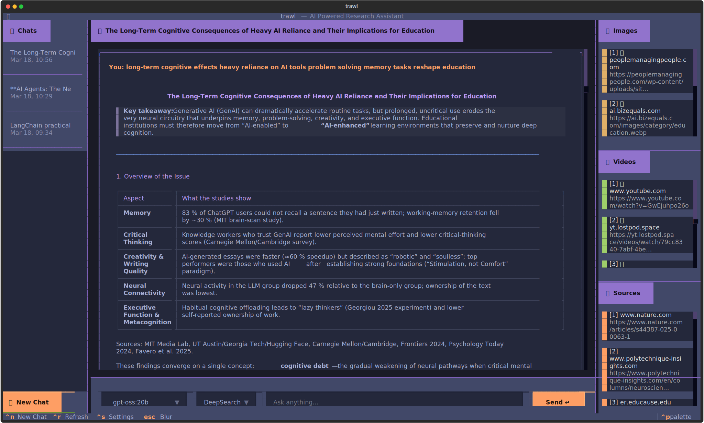
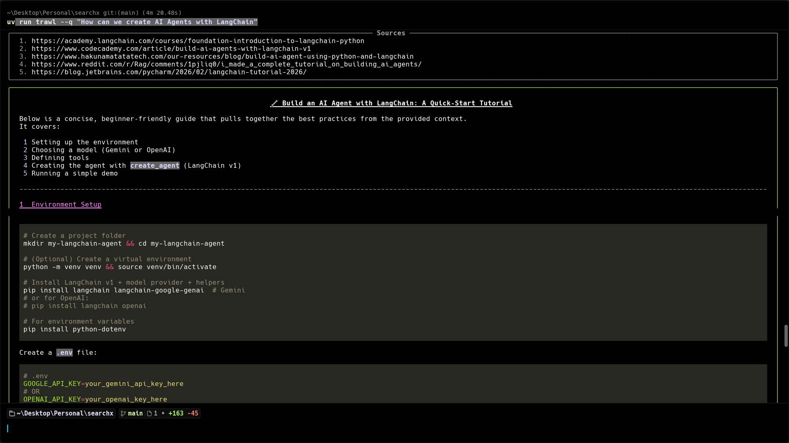

# trawl - On-Premise AI Powered Research Assistant

[](https://www.python.org/downloads/)
[](https://fastapi.tiangolo.com/)
[](https://textual.textualize.io/)
[](https://opensource.org/licenses/MIT)

**trawl** is a high-performance, On-Premise AI Powered Research Assistant with terminal interface. Inspired by modern search assistants like Perplexity, it brings deep-dive research capabilities directly to your command line.




---

## Features

- **Animated Streaming Responses**: Real-time markdown streaming with live spinners and status updates in the terminal.
- **Stable Research UI**: A structured terminal layout using `Rich` to show research progress, sources, and media links without flickering.
- **Visual Research Insights**: Automatic detection and display of relevant images and videos discovered during research.
- **Integrated Configuration**: Manage your provider (Gemini/Ollama), API keys, and models directly from the CLI.
- **Source Citations**: Clean display of research sources with clickable links (where supported by the terminal).
- **Persistent Threads**: Full chat history support powered by PostgreSQL and SQLAlchemy.
- **Premium TUI**: A sleek, customizable terminal interface with both Light and Dark themes.
- **Fast-API Backend**: Robust, asynchronous backend architecture for multi-step research.
- **Vector Search**: pgvector-powered semantic search for efficient document retrieval.

---

## Roadmap

Here's what's coming next to make trawl even more powerful. Contributions towards any of these are especially welcome!

| Status | Feature                            | Description                                                                                                                          |
| :----- | :--------------------------------- | :----------------------------------------------------------------------------------------------------------------------------------- |
| [ ]    | **More LLM Providers**             | Support for Anthropic, OpenAI, Mistral, and other popular providers beyond.                                                          |
| [ ]    | **Research Modes**                 | Choose your depth — Quick (fast, 1–2 sources), Deep Research (thorough, 10+ sources), and Academic (prefers arXiv, PubMed, Scholar). |
| [ ]    | **Follow-up Question Suggestions** | After each answer, trawl will surface related questions you can instantly continue the thread with.                                  |
| [ ]    | **File Upload & Analysis**         | Drop in a PDF, DOCX, or folder and ask questions against your local files — combined with live web search.                           |

---

## Technology Stack

- **Frontend**: [Textual](https://textual.textualize.io/) (Rich TUI Framework)
- **Backend**: [FastAPI](https://fastapi.tiangolo.com/) (Asynchronous Python Web Framework)
- **Database**: [PostgreSQL](https://www.postgresql.org/) with [pgvector](https://github.com/pgvector/pgvector) and [SQLAlchemy](https://www.sqlalchemy.org/) ORM
- **LLM Engine**: Integration with Google Gemini / Ollama
- **Search Engine**: [SearxNG](https://github.com/searxng/searxng)
- **Embeddings**: [Sentence Transformers](https://www.sbert.net/)

---

### Docker Quick Start (Recommended)

The fastest way to get `trawl` up and running is using Docker. This will start the backend, database, and search engine automatically.

```bash
# 1. Clone and enter the repository
git clone https://github.com/udaykumar-dhokia/trawl.git
cd trawl

# 2. Start the stack (this includes Ollama, PostgreSQL, and SearXNG)
docker compose up -d
```

### Interact with Docker

Once the containers are running, you can use the `trawl` CLI to perform research or manage configuration.

```bash
# Run research through the Docker backend
docker exec -it trawl_backend uv run trawl research "How can we create AI Agents with LangChain?"

# View configuration inside Docker
docker exec -it trawl_backend uv run trawl config view
```

---

## Manual Installation

### Prerequisites

- [Python 3.10+](https://www.python.org/downloads/)
- [uv](https://github.com/astral-sh/uv) package manager
- PostgreSQL database
- SearxNG instance (optional, for web search)

### Installation

```bash
git clone https://github.com/udaykumar-dhokia/trawl.git
cd trawl
uv sync
```

### Configuration

1. Copy the environment template:

   ```bash
   cp .env.example .env
   ```

2. Edit `.env` with your database and API keys.

---

## Usage

### Research Mode

```bash
# Basic research query
trawl research "Your query here"

# Short flag
trawl research --q "Your query here"
```

### Configuration Management

```bash
# View current settings
trawl config view

# Update a setting
trawl config set provider google
trawl config set google_api_key YOUR_API_KEY
```

### Terminal User Interface (TUI)

```bash
# Start the interactive dashboard
trawl tui
```

### Programmatic Usage

```python
import asyncio
from trawl.services.invoke_chat import invoke_chat

async def main():
    async for chunk in invoke_chat(query="How do bees fly?"):
        print(chunk)

if __name__ == "__main__":
    asyncio.run(main())
```

---

## Development

### Setup Development Environment

```bash
# Run the development setup script
./scripts/setup-dev.sh

# Or manually
uv sync --dev
cp .env.example .env
```

### Running Tests

```bash
# Run all tests
uv run pytest

# With coverage
uv run pytest --cov=trawl

# Run specific test
uv run pytest tests/test_specific.py
```

### Code Quality

```bash
# Lint code
uv run ruff check .

# Format code
uv run ruff format .

# Type checking
uv run mypy .
```

### Building

```bash
# Build package
uv build

# Or using make
make build
```

---

## Project Structure

```
trawl/
├── cli.py              # Command-line interface
├── main.py             # FastAPI application
├── tui_app.py          # Textual TUI interface
├── core/               # Core configuration and utilities
├── db/                 # Database models and connections
├── models/             # SQLAlchemy models
├── schemas/            # Pydantic schemas
├── services/           # Business logic services
└── utils/              # Utility functions

tests/                  # Test suite
docs/                   # Documentation
examples/               # Usage examples
scripts/                # Development scripts
.github/                # GitHub Actions and templates
```

---

## Contributing

We welcome contributions! Please see our [Contributing Guide](CONTRIBUTING.md) for details.

1. Fork the repository
2. Create a feature branch
3. Make your changes
4. Add tests
5. Submit a pull request

---

## License

This project is licensed under the MIT License - see the [LICENSE](LICENSE) file for details.

---

## Changelog

See [CHANGELOG.md](CHANGELOG.md) for version history.

---

## Support

- 📖 [Documentation](https://github.com/udaykumar-dhokia/trawl#readme)
- 🐛 [Issues](https://github.com/udaykumar-dhokia/trawl/issues)
- 💬 [Discussions](https://github.com/udaykumar-dhokia/trawl/discussions)

---

## Keyboard Shortcuts (TUI)

| Shortcut   | Action            |
| :--------- | :---------------- |
| `Ctrl + N` | New Chat          |
| `Ctrl + R` | Refresh Chat List |
| `Escape`   | Blur / Exit Input |
| `Ctrl + C` | Quit Application  |

---

<p align="center">Built with ❤️ by udthedeveloper</p>
